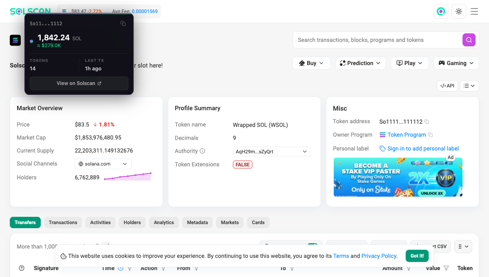
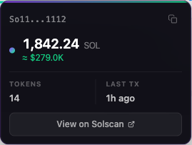

# SolanaLens

**[solanalens.ariesspring.dev](https://solanalens.ariesspring.dev)**

A Chrome extension that lets you hover over any Solana address on any webpage and instantly see the wallet's SOL balance, USD value, token count, and last transaction time — without leaving the page.



## Features

- **Hover to inspect** — detects Solana addresses in page text, links, and data attributes
- **Live balance** — SOL amount with USD conversion via CoinGecko
- **Token count** — SPL tokens and Token-2022 accounts
- **Last transaction** — relative time of the most recent on-chain activity
- **Copy address** — one click from the tooltip
- **View on Solscan** — quick link to the full account page
- **Custom RPC** — bring your own endpoint via the popup
- **Enable/disable toggle** — turn off detection site-wide instantly
- **Works on SPAs** — MutationObserver picks up dynamically injected addresses



## Installation

### From the Chrome Web Store

Visit **[solanalens.ariesspring.dev](https://solanalens.ariesspring.dev)** or search "SolanaLens" in the Chrome Web Store and click **Add to Chrome**.

### From source

1. Clone the repo
   ```sh
   git clone https://github.com/Aries-Spring/SolanaLens.git
   ```
2. Open Chrome and go to `chrome://extensions`
3. Enable **Developer mode** (top right)
4. Click **Load unpacked** and select the cloned folder
5. The SolanaLens icon will appear in your toolbar

### Icons (first time only)

If the icons are missing, generate them once with Node.js — no dependencies required:

```sh
node generate-icons.js
```

## Usage

Hover over any Solana address on any webpage. The tooltip appears automatically.

- **Copy** — click the copy icon in the tooltip header
- **Open in Solscan** — click "View on Solscan" in the tooltip footer
- **Keyboard** — focus an address with Tab, press Enter or Space to copy, Escape to dismiss
- **Custom RPC** — click the extension icon and enter your RPC URL, then Save
- **Disable** — click the extension icon and toggle the switch off

## Privacy

SolanaLens makes two types of outbound requests:

| Request | Destination | Purpose |
|---|---|---|
| Balance / token data | Your configured RPC (default: `api.mainnet-beta.solana.com`) | Fetch wallet data |
| SOL price | `api.coingecko.com` | USD conversion |

No data is collected, stored externally, or sent anywhere else. All caching is in-memory and cleared when the service worker restarts.

## Permissions

| Permission | Why |
|---|---|
| `storage` | Save your RPC URL and enabled/disabled preference |
| `host_permissions: <all_urls>` | Inject the content script on all pages to detect addresses |

## Contributing

Pull requests are welcome. Open an issue first for larger changes.

## License

MIT
